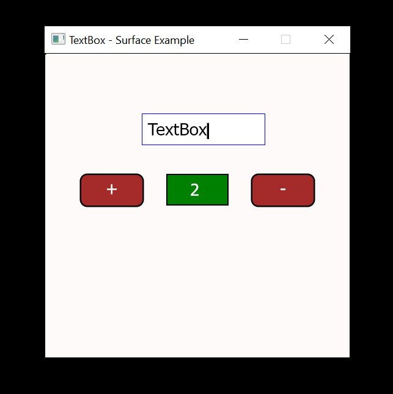

# Skia-Surface

This simple app demonstrates the new textBox Widget and ViewModel.

The TextBox is still being developed.    
It currently implements backspace, delete, cursor movement via arrow keys,
but as yet has no text 'selection'.

 

The two buttons; `+`, `-`, increment and decrement the counter Label.    
There is no reference between any of these elements or their respective viewmodels.    
They simply publish and subscribe to events and messages to and from one another.    
 

The counter viewmodel manages the counter state.    
If count `limits` are exceeded, it will fire an event to `show` a popup!   
The popup knows nothing about any other elements.  It simply waits for any show or hide events.      
Events can carry state or command payloads.  A popup `show` event will carry the text to be shown.

The TextBox Widget is similar to a DOM text-input element. Its viewmodel waits for input events, and manages text state. It then fires state-change events to the view to update its display.

Obviously, a canvas rendering Widget can't emulate user interaction. That is the job of the viewmodel.  The textBoxVM subscribes to user interaction as well as a Widgets view state. It then publishes new view state to allow the Widget to display appropriate visual cues like focused, hovered.  If focused, it displays a blinking cursor, and cursor movement. 

 

## Try it!
To run the example, on a command line enter:  

deno run -Ar --unstable https://raw.githubusercontent.com/nhrones/SkiaSurface/master/examples/TextBox/main.ts